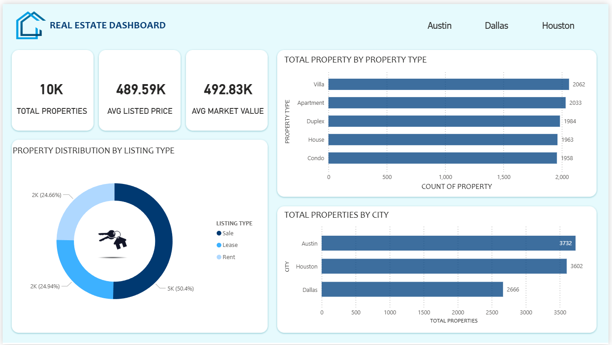
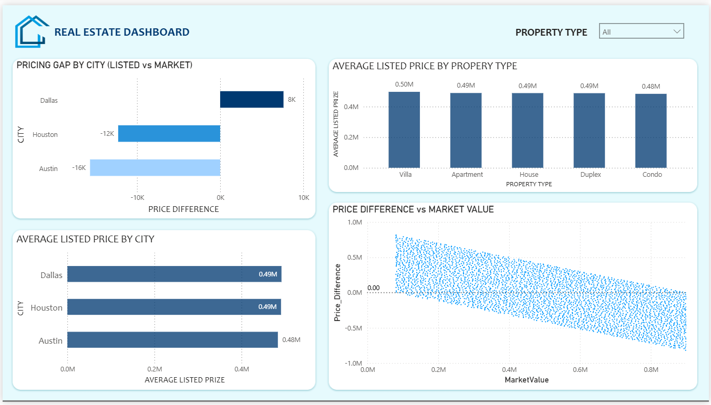
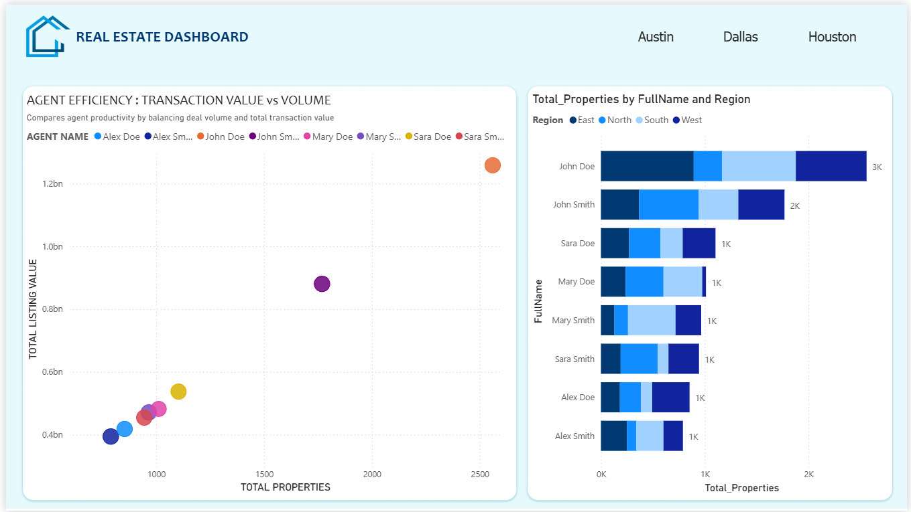

# Real Estate Market Analysis Dashboard | Power BI

## Overview
This project presents an end-to-end **Real Estate Market Analysis Dashboard** developed using **Power BI**.  
The dashboard analyzes property listings across multiple cities to uncover insights related to **pricing efficiency, agent and office performance, ownership concentration, and neighborhood-level factors**.

The goal is to understand **pricing behavior, operational performance, portfolio concentration, and location-based value drivers** using descriptive analytics.

---

## Dataset Overview
The analysis is based on a structured real estate listings dataset containing:

- **~10,000 property listings**
- **300+ real estate agents**
- **50 offices**
- **500+ property owners**
- **Multiple cities**, including **Austin, Dallas, and Houston**
- Attributes covering:
  - Listed price and estimated market value  
  - Property features and condition  
  - Agent experience and activity  
  - Office performance  
  - Ownership portfolios  
  - Neighborhood indicators (crime rate, income, school rating, quality score)

The dataset represents **property listings**, not completed sales.

---

## Tools & Technologies
- **Power BI** – Dashboard development, data modeling, and visualization  
- **Power Query** – Data cleaning and transformation  
- **DAX** – Measures, KPIs, ratios, and efficiency calculations  

---

## Main Dashboard (Project Overview)

The project contains **multiple analytical dashboards (15+ pages)** covering different business dimensions.  
For GitHub presentation and ease of review, the **primary dashboard views** are highlighted below.

### 🔹 Dashboard Preview

#### Property Overview

#### Property Pricing Analysis

#### Agent Performance

---

📄**Full Dashboard (All Pages – PDF):**  
🔹[View Complete Dashboard PDF](05_Dashboard/Real_Estate_Dashboard.pdf)

This PDF contains **all 15+ dashboard pages**.

---

## Key Insights

### Pricing & Market Behavior
- Average listing values range between **$0.55M – $2.2M** depending on city and neighborhood
- Certain cities consistently show **overpricing or underpricing gaps** relative to estimated market value
- Pricing efficiency varies significantly by **office and agent experience level**

---

### Agent Performance Insights
- **Mid-level agents (3–6 years experience)** handle **fewer properties** but achieve the **highest average listing value (~$0.50M per property)**
- Veteran agents manage **higher volume**, but average listing value plateaus
- This reveals a **quality-over-quantity efficiency sweet spot** at mid experience levels

---

### Office-wise Performance
- Top offices handle **300–400+ properties**, generating **$150M–$200M+** in listing value
- Strong positive correlation between **portfolio size and total listing value**
- Some offices achieve **higher value per property**, indicating better pricing efficiency

---

### Owner & Portfolio Distribution
- Portfolio ownership is **highly concentrated**
- One top owner (e.g., *Peter*) controls **~2,300+ properties** with **~$1.15B portfolio value**
- Majority of owners hold **11–20 properties**, while a small group dominates total market value
- This suggests presence of **institutional or investment-heavy owners**

---

### Neighborhood Analysis
- High-income neighborhoods show **average listing prices ~20–30% higher**
- Crime rate impact is present but **not linear**
- Neighborhood quality score aligns more closely with pricing than crime alone
- Top neighborhoods consistently exceed **$1.7M–$2.2M average listing price**

---

## Key Takeaways
- Real estate value is driven by **location, pricing discipline, and portfolio strategy**, not just volume.
- **Efficiency metrics** (value per property) provide deeper insights than raw counts.
- Performance and ownership follow **power-law distributions**, with concentration among top contributors.
- Clear storytelling with numbers significantly improves dashboard interpretability.

---
## Project Documentation (Direct Access)

- 📄 **Case Study (End-to-End Analysis):**  
  [Real_Estate_Case_Study.docx](03_Documentation/Real_Estate_Case_Study.docx)

- 📄 **Project Summary:**  
  [Real_Estate_Project_Summary.docx](03_Documentation/Real_Estate_Project_Summary.docx)

- 📄 **Business Use Cases:**  
  [Real_Estate_Use_Cases.docx](03_Documentation/Real_Estate_Use_Cases.docx)

- 📄 **DAX Measures & Logic Appendix:**  
  [Appendix_DAX_Measures_Formatted.docx](03_Documentation/Appendix_DAX_Measures.docx)

- 📄 **Detailed Insights Report:**  
  [Real_Estate_Analysis.docx](04_Insights/Real_Estate_Analysis.docx)

---

